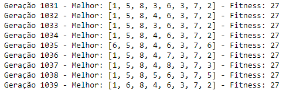
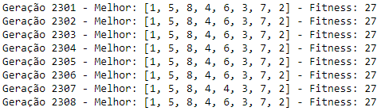

# problema8Rainhas
Resolução de problema das 8 rainhas usando algoritmo genético, implementado em python.
Repositório contém arquivo do Jupyter Notebook, para testes e gráficos.
Resultados: 3 execuções, 1000 População, X Gerações, Mutação: 3%.

Durante a execução do algoritmo, percebi que em algumas execuções ele conseguia encontrar o resultado rapidamente, e em outras, ele parecia não avançar após certo ponto, e retornava os mesmos cromossomos mesmo depois de 1000 gerações depois. Ex(1,5,8,4,6,7,3,2)
(Nessa execução eu cansei de esperar, pois passou de 3000 gerações)

Não consegui fazer o método elitista funcionar direito, pois após algumas gerações, acabavam ocorrendo erros de código.

Ao tentar usar uma população de 100:

Ocorre a mesma tendência, com o resultado podendo ser encontrado cedo ou muito tarde.

Ao usar uma mutação de 10% acabei obtendo os resultados também, sem problemas:

